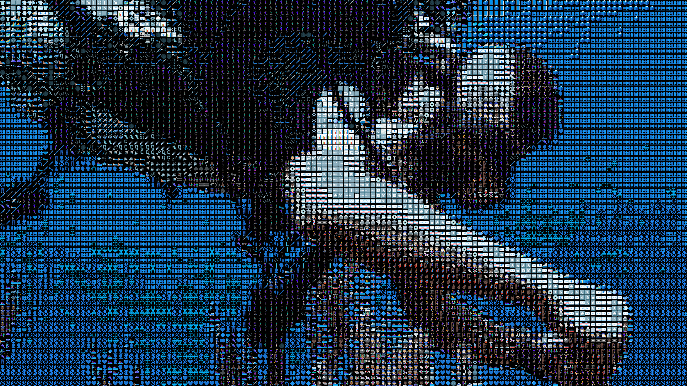
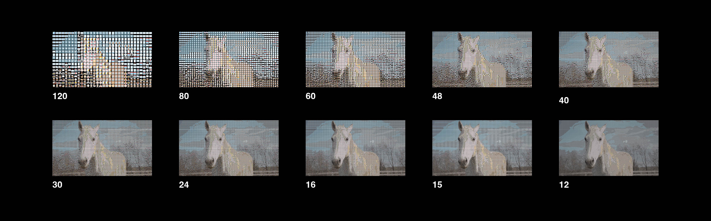

# Readme

Spritefire is a program which converts image sequences into a mosaic of sprites. It does this by matching each “tile” with the sprite that has the closest color. By default, those sprites are Noto emojis (found in the asset folder) but you could build your own library of sprites if you wish.

Spritefire exports .png files with an alpha layer, allowing for more possibilities when compositing.

## Resolution Requirements
- Output is 3840x2160 .png sequence
- Input must be a 1280x720 .png sequence
- If you are generating your own custom sprites, we recommend 512x512 .png files. Please note “blanktile” is a keyword and cannot be used as a sprite name.

## Testing the Program
- To test the project on your machine, we recommend running a `full_full_offline_test`

## Using the Program
Sprite resizing and sprite database must be built before using the program. You can do this with the `database` and `resize` argument, respectively.
The user can set their own paths in main or simply add it as an argument when calling `main`: `video <sprite size index> <image sequence path>`
Sprite sizes are as follows: `120, 80, 60, 48, 40, 30, 24, 16, 15, 12` (index 0 being 120, 1 being 80, etc)
You can also generate video for multiple sprite resolutions with `batch_res <image sequence path>`. This is currently set to all possible resolutions in the `main`

## Best Practices
The program is most stable on smaller clips, after being compiled, so we recommend compiling before using.
The transparent pixels in our emojis are red as just black, so darker areas in source images will result in more transparent mosaics.
The program also will read alpha channels from source images

## After Effects Resolution Switcher
The AE file included provides a template for switching quickly between resolutions. It should link automatically to sequences generated with the `full_full_offline_test`

# Roadmap and To-Do
## Up Next:
- [ ] Use Raylib the sprite resize
- [ ] Use a Goroutine the database creation
- [ ] Better Continuous Integration, hopefully one that can handle
- [ ] Fix issue where it crashes after large resolution batches
- [ ] Don't open the raylib window each time (perhaps just once and keep it open)
- [ ] Batch importer/automatic setup for after effects
- [ ] Illustrated readme file with gifs
- [ ] Generate docs

## Later On:
### Custom Sprites
Takes in a folder of images and pulls out subject specific sprites from them
### Read Sprite Alpha As
Alpha channels in sprites can be read as either red, blue, green, luma, or black, so you can composite with different background colors
### GUI
Adjust settings (such as alpha compensation) in a raylib GUI. You should be able to run everything through this new GUI.
### LUT
Match the sprites using a Look Up Table
