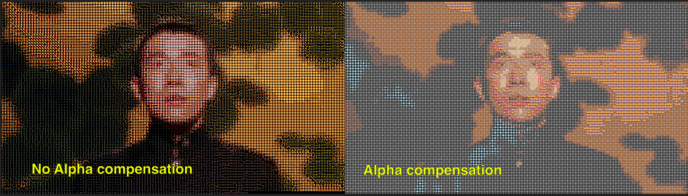
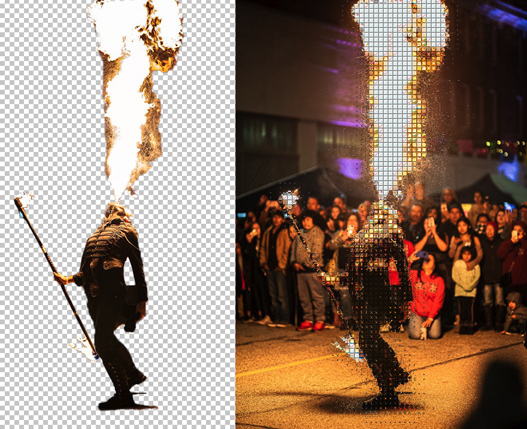
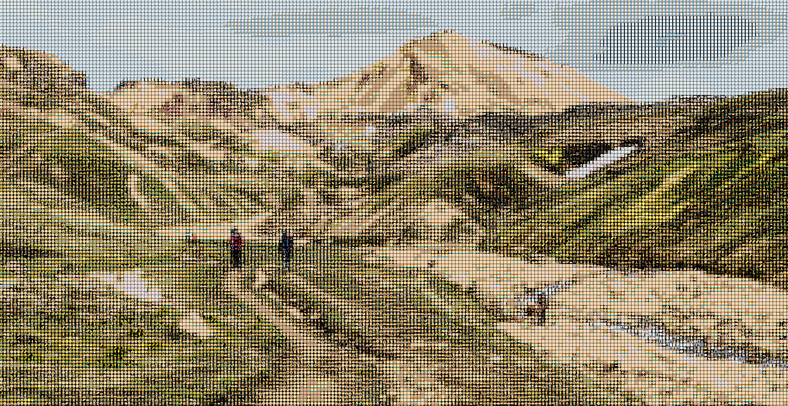

# Spritefire
Spritefire is a simple graphics program which converts images and videos into mosaics of many tiny images.

# Overview

Spritefire takes in a source image and matches each pixel in a down-resed version to the sprite with the closest color. By default, those sprites are Noto Emojis (found in the asset folder), but you could build your own library of sprites if you wish.
Before creating a mosaic, Spritefire must generate a database of the average color for each sprite. This average is determined by adding all the red, green, and blue values in each pixel and then dividing each channel by the number of pixels in the sprite.
After the user determines desired size of the tiles, the source image is resized so that there is only one pixel for each tile. The program then iterates through each pixel in the image, matching it to the closest sprite. These matches are saved to a temporary `canvas`, which is used by the `draw` function to render and save the image.

# Implementation
## Euclidean Color Distance
The "closest sprite" is determined by the Euclidean Color Distance in `RGB` space: $$distance=\sqrt{(R_{sprite}-R_{pixel})^2+(G_{sprite}-G_{pixel})^2+(B_{sprite}-B_{pixel})^2}$$
Where $Channel_{sprite}$ is the average channel color of a the sprite and $Channel_{pixel}$ is the channel value of the resized input image's tile.
In go:
`math.Sqrt(float64((a.R-b.R)*(a.R-b.R) + (a.G-b.G)*(a.G-b.G) + (a.B-b.B)*(a.B-b.B)))` 

## K-D Trees
Originally, Spritefire used a naive search to find the closest sprite for a given tile. For each tile, the entire database of sprites was checked to find the closest entry. This took prohibitively long, so a K-D tree search was implemented. This search methodology finds the nearest neighbor in an arbitrarily amount of dimensions. For our three-dimensional color space, the K-D tree allows us to cut the search space in half along a given color channel (red, green or blue) at each step, increasing efficiency much like binary search would.

## A note on Alpha layers, Art, and K-dimensional Space

A previous version of Spritefire attempted to use the scalable dimensionality of K-D trees to incorporate the alpha layer. After all, what is alpha if not simply an additional dimension to `RGB` space? This worked, technically, but provided some disappointing results, artistically. When compensating for the alpha layer, the program did what it was told: matching only fully opaque sprites to the fully opaque tiles. Unfortunately, given that most emojis heavily rely on alpha layers, this severely limited the amount of emojis used on most images (see above).
A possible solve would have been to key out the darker pixels when generating the source .png sequence. This, however, adds an extra step and is hard to control without a realtime GUI to monitor the results.
 \n
As a compromise, the program now will read source alpha and simply elect not to draw a tile if the given source pixel is transparent. This allows for some flexibility when compositing. Note that the transparent pixels in the Noto Emojis are totally black, so darker areas in the source image will result in more transparent areas in the final mosaic output.

# Instructions for Your First Project
## Step by Step
- Output your source video as a 1280x720 .png sequence
- Ensure that Go and all the necessary dependencies are installed. These can be found in the `go.mod` file at the root of the repository
- In the command line, navigate to the man packet. From the repository root this can be done with `cd src/main`
- Compile the program to an executable with `go build main.go`
- Generate the sprite database with `./main database` (you will only have to do this once)
- Generate the resized sprits with `./main resize` (you will only have to do this once)
- Process your video with `./main video <index> <path/to/your/source/png/sequence>`

## Notes
- To start, 4 is a good index. See Sprite Size Index Key below for more infromation
- If you wish to see all the arguments, simply run `./main`

# Usage Notes
 
## Resolution Requirements
- Output is 3840x2160 .png sequence
- Input must be a 1280x720 .png sequence
- If you are generating your own custom sprites, we recommend 512x512 .png files. Please note “blanktile” is a keyword and cannot be used as a sprite name.

## Testing the Program
- To test the project on your machine, we recommend running a `full_full_offline_test`

## Sprite Size Index Key

Sprites sizes are determined by a list of possible sizes. These are hard coded to be common divisors of the input and output resolution to avoid glitches in the canvas.
Each index can be found below with it's corresponding sprite size:
`i: size`
`0: 120`
`1: 80`
`2: 60`
`3: 48`
`4: 40`
`5: 30`
`6: 24`
`7: 16`
`8: 15`
`9: 12`

If you wish to generate all possible sprite sizes you can do so with `./main batch_res <path/to/your/source/png/sequence>`

## After Effects Resolution Switcher
The AE file included provides a template for switching quickly between resolutions. It should link automatically to sequences generated with the `full_full_offline_test`

# Roadmap

## Up Next:
### Front-end
- [ ] User friendly binary file that anyone can use without having to compile the source code themselves
- [ ] Illustrated readme file with gifs (both for example images and instructions)
- [ ] Batch importer/automatic setup for after effects
- [ ] Change `database` to `map`, or a different word with less shared reference

### Back-end
- [ ] Use Raylib the sprite resize
- [ ] Use a Goroutine the database creation
- [ ] Better Continuous Integration, hopefully one that can handle the entire process
- [ ] Fix issue where it crashes after large resolution batches
- [ ] Don't open the raylib window each time (perhaps just once and keep it open)
- [ ] Generate docs

## Later On:
### Custom Sprites
Takes in a folder of images and generates appropriately sized sprites of specific subjects.
### Read Sprite Alpha As
Alpha channels in sprites can be read as either red, blue, green, luma, or black, so you can composite with different background colors.
### GUI
Adjust settings (such as alpha compensation) in a raylib gui. You should be able to run everything through this new interface.

